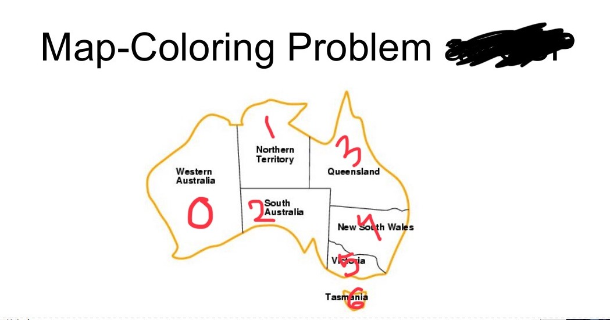
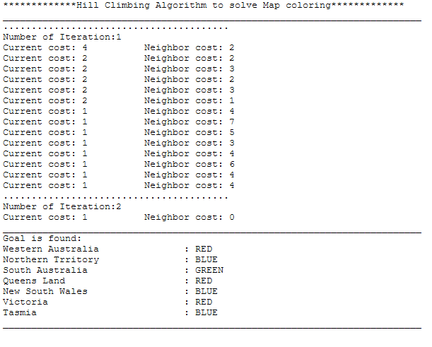
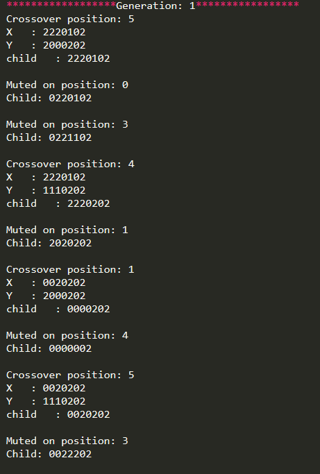
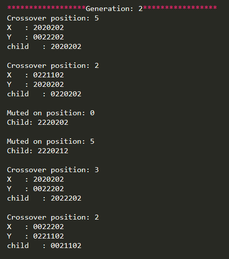
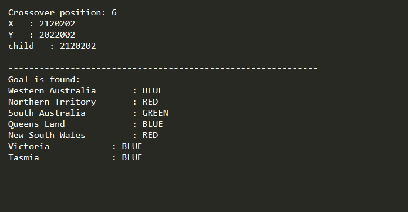

# Map-coloring-using-Hillclimbing-in-java
The following map is using for this problem

<h1 align="center">Solutions of the Algorithms</h1>

# Hill Climbing 

# Simulate Annealing 

# Genetic Algorithm

<h2 align="center">Thank You </h2>

